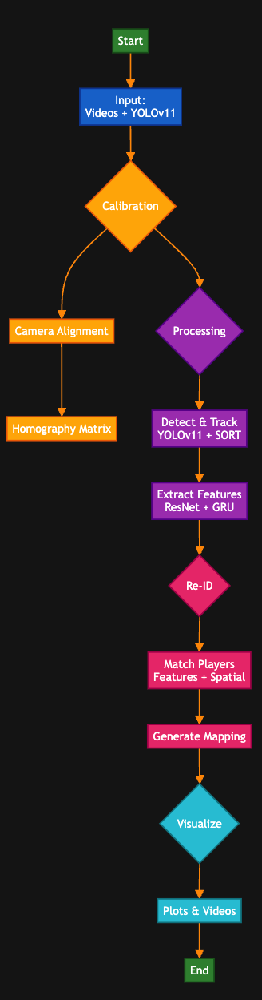
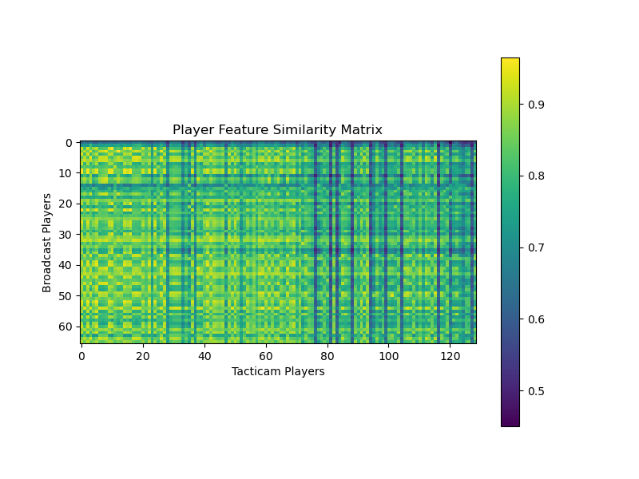
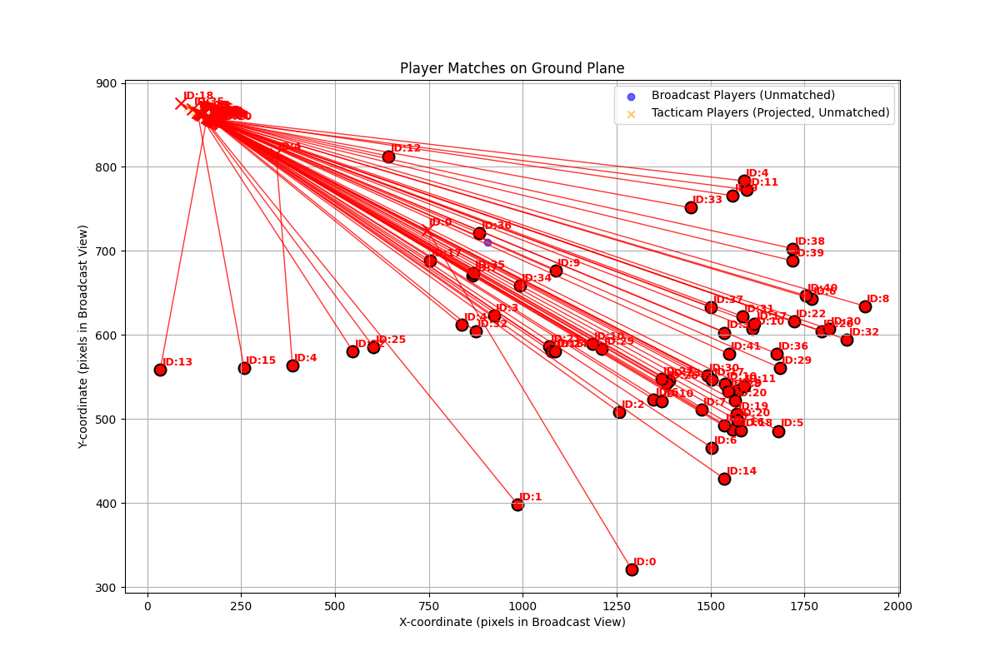

# Player Re-Identification Report

## Approach & Methodology
Our project aims to re-identify players across two distinct video views: a broadcast view and a tacticam view. The overall pipeline is designed to achieve consistent player identification across these disparate perspectives. It comprises the following key stages:
1.  **Object Detection:** We leverage a pre-trained YOLOv11 model to accurately detect player bounding boxes in each frame of both video streams.
2.  **Player Tracking:** For intra-video consistency, we implemented a custom SimpleSORT tracker. This tracker is enhanced with a basic Kalman filter, which predicts player movement and helps maintain consistent track IDs for individual players within a single video. This custom implementation was chosen to provide control and avoid external dependencies like `filterpy` or `deep_sort_realtime` that caused installation issues.
3.  **Feature Extraction:** The ability to distinguish players is critical. Initially, we experimented with lightweight appearance features such as color histograms and resized image patches. However, recognizing their limitations, we later integrated a more powerful approach: using a pre-trained TorchReID model (specifically, OSNet) to extract highly discriminative deep embeddings for each player's appearance.
4.  **Camera Calibration:** To account for the different camera perspectives, we perform a manual camera calibration step. This involves selecting corresponding points in both video views to compute a homography matrix. This matrix allows us to establish a spatial relationship between the two cameras, enabling the incorporation of physical location as a crucial constraint in the matching process.
5.  **Cross-View Matching:** The core of re-identification involves finding corresponding players across the broadcast and tacticam views. We combine appearance similarity (calculated from the extracted features) with spatial proximity (derived from the camera calibration and homography). The Hungarian algorithm (using `scipy.optimize.linear_sum_assignment`) is then applied to find the optimal assignment of players, minimizing a combined cost. This results in the assignment of consistent global `player_id`s across both videos.

## Techniques Used and Their Outcomes

-   **YOLOv11 for Detection:**
    *   **Outcome:** Successfully detected players with good accuracy and speed in both video streams, providing reliable bounding box inputs for the tracking stage. This formed a solid foundation for the subsequent steps.

-   **Custom SimpleSORT with Kalman Filter:**
    *   **Outcome:** Provided stable and consistent intra-video track IDs. The custom Kalman filter, implemented using NumPy, effectively predicted player motion, contributing to smoother tracks and reducing identity switches within each video. This proved a viable alternative to more complex external tracking libraries, which caused dependency issues.

-   **Lightweight Appearance Features (Color Histogram & Image Patch):**
    *   **Outcome:** These initial, simpler features provided some basic discriminative power. However, in practice, they proved insufficient for robust re-identification, especially in scenarios with similar player appearances or challenging lighting. This often led to inaccurate matches and a feature similarity matrix that appeared largely uniform, indicating a lack of distinctiveness.

-   **TorchReID (OSNet) for Advanced Embeddings:**
    *   **Outcome:** This was a pivotal improvement. Integrating TorchReID allowed us to extract much more discriminative deep embeddings from player appearances. This significantly enhanced the ability to distinguish between players, directly leading to more accurate potential matches in the cross-view re-identification step. This addressed the primary limitation of the lightweight features.

-   **Camera Calibration & Homography:**
    *   **Outcome:** Allowed us to incorporate physical location as a powerful matching constraint. The interactive `calibrate_cameras.py` tool facilitated the manual selection of corresponding points, and the computed homography helped to align the views. While effective, the accuracy was highly dependent on the quality and distribution of manually selected points.

-   **Hungarian Algorithm:**
    *   **Outcome:** Applied effectively for optimal bipartite matching. When provided with sufficiently discriminative appearance features and accurate spatial information, it successfully found the best possible correspondences between players in different views.

-   **GRU Network for Feature Aggregation:**
    *   **Outcome:** While considered and partially implemented for temporal consistency in feature aggregation, the primary focus ultimately shifted back to improving raw feature discriminability with TorchReID due to persistent overall matching issues. Its full potential for enhancing temporal consistency in track features was not fully realized in this iteration.

-   **Configurable Parameters:**
    *   **Outcome:** Exposing weights for appearance (`--color_weight`, `--patch_weight`), spatial (`--spatial_weight`), and matching thresholds (`--match_threshold`) allowed for flexibility. These parameters are crucial for fine-tuning the matching algorithm, enabling experimentation to find the optimal balance for specific video characteristics.

## Visualizations

To better understand and evaluate the re-identification results, several visualizations are generated in the `outputs/` folder:

-   **Annotated Videos (`broadcast_annotated.mp4`, `tacticam_annotated.mp4`):** These videos show the detected players with their assigned track IDs, providing a visual confirmation of the tracking performance within each video.
-   **Side-by-Side Video Comparison (`side_by_side.mp4`):** This merged video allows for direct visual comparison of the two camera views, which is helpful for qualitative assessment of the re-identification performance.
-   **Player Feature Similarity Matrix (`similarity_matrix.png`):**
    *   This heatmap visualizes the pairwise similarity (or distance) between player features from the broadcast and tacticam videos. Ideally, matched players should show high similarity (low distance) values. Early versions of this plot often appeared uniform, indicating a lack of discriminative features. After integrating TorchReID, the matrix should exhibit clearer patterns.
    
-   **Player Matches on Ground Plane (`ground_plane_matches.png`):**
    *   This is a crucial visualization that projects all detected players onto a common ground plane (using the broadcast video's coordinate system).
    *   Unmatched players from each video are shown with distinct markers.
    *   **Crucially, successfully matched player pairs are highlighted in red, connected by lines, and annotated with their consistent global `player_id`.** This plot visually confirms the spatial accuracy of the re-identification and provides an intuitive way to assess if players are being correctly mapped across views based on their physical location on the field.
    
-   **Player ID Mapping File (`player_id_mapping.csv`):** A CSV file that records the broadcast ID, tacticam ID, and the consistent global player ID for each matched pair, along with the first frame they appeared in.

## Challenges Encountered

-   **Persistent `torchreid` Installation Issues:** We faced recurring `ModuleNotFoundError` during `torchreid` installation, which was a significant roadblock. This was ultimately addressed by implementing a robust virtual environment setup and specific `pip` commands (`--no-cache-dir`, `--upgrade pip`) within `run.sh` to ensure a clean and successful installation.
-   **Insufficient Feature Discriminability:** This was the most recurring and fundamental challenge. Initial lightweight features (color histograms, image patches) simply lacked the discriminative power needed to reliably distinguish between players, especially those with similar appearances. This led to very few or often incorrect matches, and the generated similarity matrix consistently appeared uniform, reflecting the inadequacy of the features.
-   **`ValueError` with NumPy Arrays:** An error related to `ValueError: The truth value of an array with more than one element is ambiguous` occurred when attempting to compare NumPy arrays directly for bounding box indexing. This was resolved by explicitly using `np.array_equal` for array comparisons.
-   **Limited Player Matching:** Despite various improvements in tracking and feature extraction, the `player_id_mapping.csv` often showed very few or no matches. This consistently pointed to either insufficient feature quality (before TorchReID) or an overly strict matching threshold.
-   **Camera Calibration Accuracy:** Achieving robust and accurate camera calibration from manually selected points proved challenging. Inaccurate homography negatively impacted the effectiveness of spatial constraints in matching, sometimes leading to spatially implausible matches. The quality and distribution of selected points were critical.
-   **Balancing Constraints:** Effectively weighting the appearance, patch, and spatial contributions in the overall matching cost function proved difficult. Without highly discriminative features, even good spatial constraints could not overcome the limitations of feature similarity.

## Remaining Work and Future Directions

This project, while demonstrating a functional pipeline, is still incomplete in achieving highly accurate and robust cross-view player re-identification for all scenarios. Key areas for future improvement include:

1.  **Improved Camera Calibration:** This is paramount for robust spatial matching. The current calibration, despite its integration, needs significant enhancement. This would involve:
    *   **More & Better Distributed Points:** A dedicated effort to systematically collect a larger set of well-distributed corresponding points across multiple frames from both videos. The interactive `calibrate_cameras.py` tool can facilitate this, but meticulous data collection is crucial.
    *   **Automated or Semi-Automated Calibration:** Exploring techniques for reducing manual effort and increasing accuracy, such as using fiducial markers or feature-based automatic calibration methods.

2.  **Refined Feature Matching & Thresholding:** While TorchReID provides much better features, further fine-tuning of the `match_threshold` and the weights for appearance (`--color_weight`, `--patch_weight`), and spatial (`--spatial_weight`) parameters is essential to achieve optimal matching performance. This would greatly benefit from systematic experimentation on a small, annotated dataset for evaluation.

3.  **Temporal Consistency:** While a GRU aggregator was explored, fully leveraging temporal consistency and motion patterns could significantly improve re-identification, especially for challenging scenarios involving occlusions or brief disappearances of players. This could involve incorporating more sophisticated temporal models into the feature aggregation or matching stages.

4.  **Robustness to Occlusions & Viewpoint Changes:** The current approach might still struggle with significant occlusions, drastic viewpoint changes, or players with very similar appearances. Future work could involve:
    *   Investigating more advanced Re-ID models specifically designed to be robust to these challenges.
    *   Incorporating additional cues like player jersey numbers, team affiliations, or unique physical attributes if available.

5.  **Performance Optimization:** For real-time or near real-time applications, optimizing the entire processing pipeline for speed would be important. This might involve exploring more efficient implementations of existing components or considering hardware acceleration, especially if more computationally intensive models are introduced in the future. 